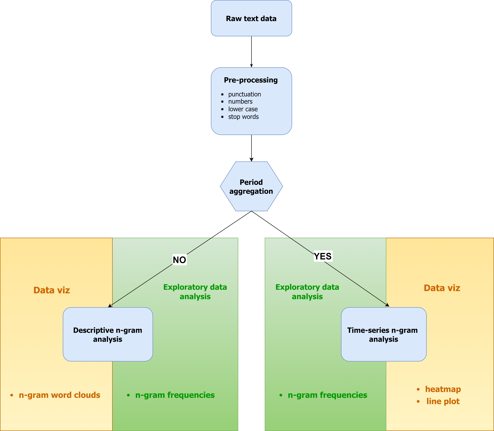

Data structure and requirements
=====

-----
Period aggregation
-----

**Arabica** accepts text and time columns as inputs:

- **Text** is a written record (speech, review, title, article, ..)

- **Time** is a time specification for the recorded text

These aggregation combinations are provided:

* input time in **second frequency** - aggregated daily, monthly, and yearly output
* input time in **daily frequency** - aggregated monthly, yearly output
* input time in **monthly frequency** - aggregated yearly output
* input time in **yearly frequency** - aggregated yearly output

For :doc:`Descriptive n-gram analysis`, we don't aggregate data over time and make exploratory data analysis of the whole text corpus.

-----
Date and language format
-----

It reads dates in:

- **US-style**: MM/DD/YYYY (2013-12-31, Feb-09-2009, 2013-12-31 11:46:17, etc.)
- **European-style**: DD/MM/YYYY (2013-31-12, 09-Feb-2009, 2013-31-12 11:46:17, etc.) date and datetime formats.

Latin alphabet languages (English, French, Swedish, etc.) are supported.

-----
Data cleaning
-----

**Stop words** are generally the most common words in a language with no significant meaning, such as *"is"*, *"am"*, *"the"*, *"this"*, *"are"*, etc.
They are often filtered out because they bring low or zero information value. Arabica enables stopword removal for languages in the
`NLTK <https://www.nltk.org/>`_ corpus.

To print all available languages:

.. code-block:: python
   :linenos:

    from nltk.corpus import stopwords
    print(stopwords.fileids())

It is possible to remove more sets of stopwords at once by:

.. code-block:: python
   :linenos:

    stopwords = ['language 1', 'language2','etc..']