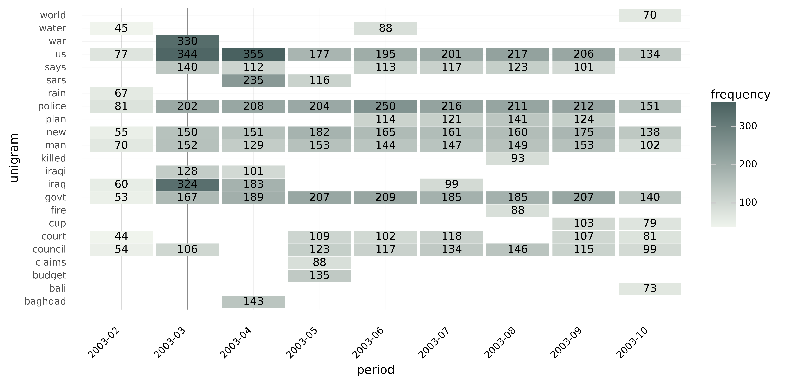

Heatmap
======

**Heatmap** displays n-grams through time. It plots n-gram-frequencies by time and assigns a color to each frequency based on the value of the n-gram.

Heatmap is a suitable visualization for datasets with large T (many periods). The graph displays unigrams (single words) and bigrams over a monthly or yearly period.

------------------------------------

**Coding example:**

**Use case:** Essential topics in newspaper headlines

**Data**: Million News Headlines dataset, source: `Australian Broadcasting Corporation <https://www.kaggle.com/datasets/therohk/million-headlines?resource=download>`_,
data licence: `CC0 1.0: Public Domain <https://creativecommons.org/publicdomain/zero/1.0/>`_.

Coding:

.. code-block:: python
   :linenos:

   import pandas as pd
   from arabica import cappuccino

.. code-block:: python
   :linenos:

   data = pd.read_csv('abcnews_data.csv', encoding='utf8')

The data looks liks this:

.. csv-table::
   :header: "headline", "date"
   :widths: 90, 10
   :align: left

   "aba decides against community broadcasting licence", 2003-2-19
   "act fire witnesses must be aware of defamation", 2003-2-19

It procceeds in this way:

* **additional strings** cleaning, if ``skip is not None``

* **lowercasing**: reviews are made lowercase so that capital letters don't affect n-gram calculations (e.g., "Tree" is not treated differently from "tree"), if ``lower_case = True``

* **punctuation** cleaning - performs automatically

* **stop words** removal, if ``stopwords is not None``

* **extended stop words** removal, if ``stopwords_extened is not None``

* **digits** removal, , if ``numbers = True``

* n-gram frequencies for each headline are calculated, aggregated by monthly frequency, and displayed in a heatmap.

.. code-block:: python
   :linenos:

   cappuccino(text = data['headline'],
              time = data['date'],
              date_format = 'us',                # Uses US-style date format to parse dates
              plot = 'heatmap',
              ngram = 1,                         # N-gram size, 1 = unigram, 2 = bigram
              time_freq = 'M',                   # Aggregation period, 'M' = monthly, 'Y' = yearly
              max_words = 10,                    # Displays 10 most frequent unigrams (words) for each period
              stopwords = ['english'],           # Remove English stopwords
              stopwords_ext = ['english'],       # Remove extended list of English stopwords
              skip = [' '],                 # Remove additional strings. Cuts the characters out without tokenization, useful for specific or rare characters. Be careful not to bias the dataset.
              numbers = True,                    # Remove numbers
              lower_case = True)                 # Lowercase text

Here is the output:

-----

Download the jupyter notebook with the code
and the data `here <https://github.com/PetrKorab/Arabica/blob/main/docs/examples/cappuccino_examples.ipynb>`_.
