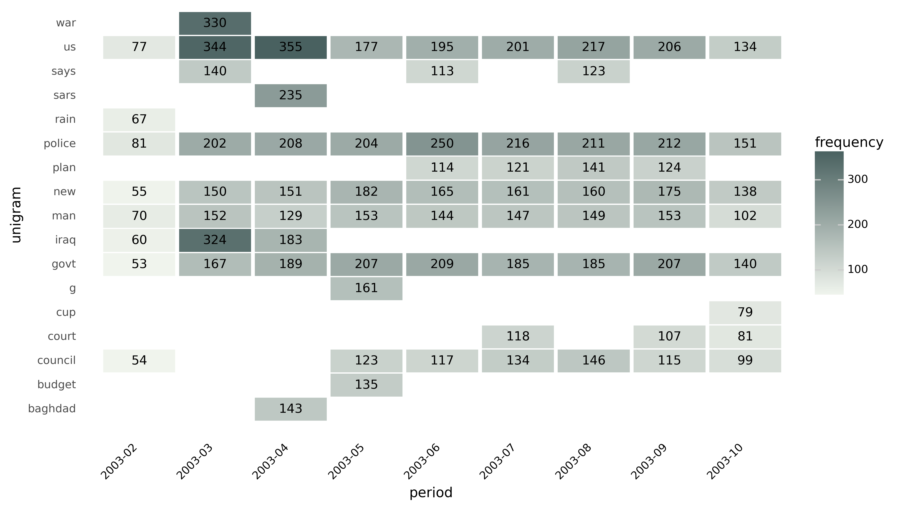

Heatmap
======

**Heatmap** displays n-grams through time. It plots n-gram-frequencies by time and assigns a color to each frequency based on the value of the n-gram.

Graph displays unigrams (single words) and bigrams over a monthly or yearly period.

------------------------------------

**Coding example:**

**Use case:** Essential topics in newspaper headlines

**Data**: Million News Headlines dataset, source: `Australian Broadcasting Corporation <https://www.kaggle.com/datasets/therohk/million-headlines?resource=download>`_,
data licence: `CC0 1.0: Public Domain <https://creativecommons.org/publicdomain/zero/1.0/>`_.

Coding:

.. code-block:: python
   :linenos:

   import pandas as pd
   from arabica import cappuccino

.. code-block:: python
   :linenos:

    data = pd.read_csv('headlines.csv', encoding='utf8')
    data.head(5)

The data subset looks liks this:

+--------------------------------------------------------------------------------------------------------+------------+
| headline                                                                                               | date       |
+========================================================================================================+============+
|aba decides against community broadcasting licence                                                      | 2003-2-19  |
+--------------------------------------------------------------------------------------------------------+------------+
| act fire witnesses must be aware of defamation                                                         | 2003-2-19  |
+--------------------------------------------------------------------------------------------------------+------------+

It procceeds in this way:

* **lowercasing**: reviews are made lowercase - capital letters don't affect n-gram calculations (e.g., "Tree" is not treated differently from "tree")

* **punctuation cleaning**

* **digits** removal

* **stop words** removal

* **additional unnnecessary strings** removal

* n-gram frequencies for each headline are calculated, aggregated by monthly frequency, and displayed in a heatmap.

.. code-block:: python
   :linenos:

   cappuccino(text = data['headline'],
              time = data['date'],
              date_format = 'us'                # Uses US-style date format to parse dates
              plot = 'heatmap',
              ngram = 1,                        # N-gram size, 1 = unigram, 2 = bigram
              time_freq = 'M',                  # Aggregation period, 'M' = monthly, 'Y' = yearly
              max_words = 8,                    # Displays 8 most frequent unigrams for each period
              stopwords = ['english'],          # Remove English stopwords
              skip = ['zz top','donald trump'],  # Remove additional strings
              numbers = True,                   # Remove numbers
              lower_case = True,                # Lowercase text before cleaning and frequency analysis
              punct = True)                     # Remove punctuation

Here is the output:

-----

Download the jupyter notebook with the code
and the data `here <https://github.com/PetrKorab/Arabica/blob/main/docs/examples/cappuccino.ipynb>`_.
