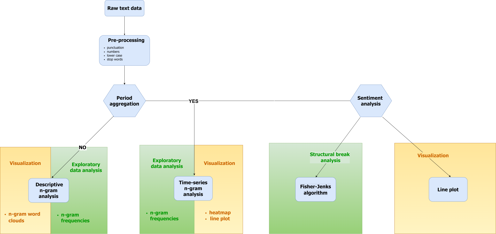

Library architecture
=====

**Arabica** accepts text and time columns as inputs:

- **Text** is a written record (speech, review, title, article, ..)

- **Time** is a time specification for the recorded text

It reads dates in:

- **US-style**: MM/DD/YYYY (2013-12-31, Feb-09-2009, 2013-12-31 11:46:17, etc.)
- **European-style**: DD/MM/YYYY (2013-31-12, 09-Feb-2009, 2013-31-12 11:46:17, etc.) date and datetime formats.

Latin alphabet languages (English, French, Swedish, etc.) are supported.

.

