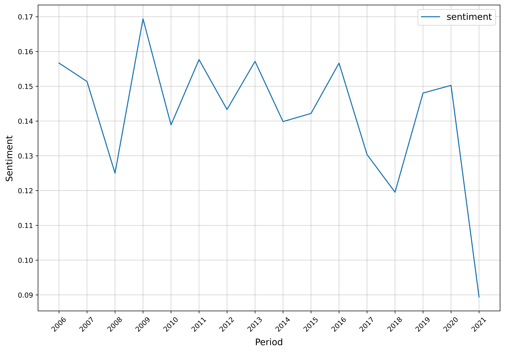

Sentiment analysis
=====

**Arabica** takes text data as the input, enables digits and punctuation cleaning, and provides time-series sentiment analysis with a pre-trained sentiment classifier.

**coffee_brek** calculates sentiment in each row of the dataset, aggregates it over a specified period, and returns a
plot and a dataframe with a corresponding time series.

------

The implemented model is **VADER** (Valence Aware Dictionary and sEntiment Reasoner), a lexicon and rule-based sentiment classifier attuned to sentiments expressed in social media. It works universally on most other types of datasets. *coffee_break* uses VADER's compound indicator for sentiment evaluation.

It was developed by:

*Hutto, C.J. & Gilbert, E.E. (2014). VADER: A Parsimonious Rule-based Model for Sentiment Analysis of Social Media Text. Eighth International Conference on Weblogs and Social Media (ICWSM-14). Ann Arbor, MI, June 2014.*

Coding example
^^^^^^

**Use case:** Sentiment analysis of Twitter tweets about Pfizer & BioNTech vaccine

**Data**: Pfizer Vaccine Tweets dataset, period: 15/07/2006: 18/11/2021, source: `Twitter API <https://www.kaggle.com/datasets/gpreda/pfizer-vaccine-tweets>`_,
data licence: `CC0: Public Domain <https://creativecommons.org/publicdomain/zero/1.0/>`_.

**Coding**:

.. code-block:: python
   :linenos:

   import pandas as pd
   from arabica import coffee_break

.. code-block:: python
   :linenos:

    data = pd.read_csv('vaccination_tweets.csv',encoding='utf8')

The data looks like this:

.. csv-table::
   :header: "text", "date"
   :widths: 83, 17
   :align: left

   "Same folks said daikon paste could treat a cytokine storm #PfizerBioNTech https://t.co/xeHhIMg1kF", "20/12/2020 06:06"
   "While the world has been on the wrong side of history this year, hopefully, the biggest vaccination effort we've ev… https://t.co/dlCHrZjkhm", "13/12/2020 16:27"
   "#coronavirus #SputnikV #AstraZeneca #PfizerBioNTech #Moderna #Covid_19 Russian vaccine is created to last 2-4 years… https://t.co/ieYlCKBr8P", "12/12/2020 20:33"

.. code-block:: python
   :linenos:

   coffee_break(text = data['text'],
                time = data['date'],
                date_format = 'eur',  # Read dates in European format
                preprocess = True,    # Clean data - digits and punctuation
                n_breaks = None,      # No structural break analysis
                time_freq = 'Y')      # Yearly aggregation

It proceeds in this way:

* **pre-processing**: tweets are cleaned from numbers, punctuation, and blank rows
* **sentiment classification**: sentiment in each row is classified with VADER sentiment classifier. The aggregate sentiment ranges between -1 (most extreme negative) and 1 (most extreme positive).
* **period aggregation**: sentiment is aggregated for a specified frequency (year or month), as follows: *aggregate sentiment* = :math:`\frac { sum(sentiment)_{t} } { count(rows)_{t}}`, where *t* is the aggregation period.
* **visualization**: aggregated time series of sentiment is displayed in a line plot

Here is the output:

-----

At the same time, Arabica returns a dataframe with the corresponding data. The table can be saved simply by:

.. code-block:: python
   :linenos:

   # generate a dataframe
   df = coffee_break(text = data['text'],
                     time = data['date'],
                     date_format = 'eur',
                     preprocess = True,
                     n_breaks = None,
                     time_freq = 'Y')

   # save is as a csv
   df.to_csv('sentiment_data.csv')

*We can see that sentiment significantly dropped after Pfizer vaccines* 
*started to be used to tackle Covid in 2021. The reason is likely* 
*the global pandemic and the generally negative mood in these years.*

Download the jupyter notebook with the code and the data `here <https://github.com/PetrKorab/Arabica/blob/main/docs/examples/coffee_break_examples.ipynb>`_.
