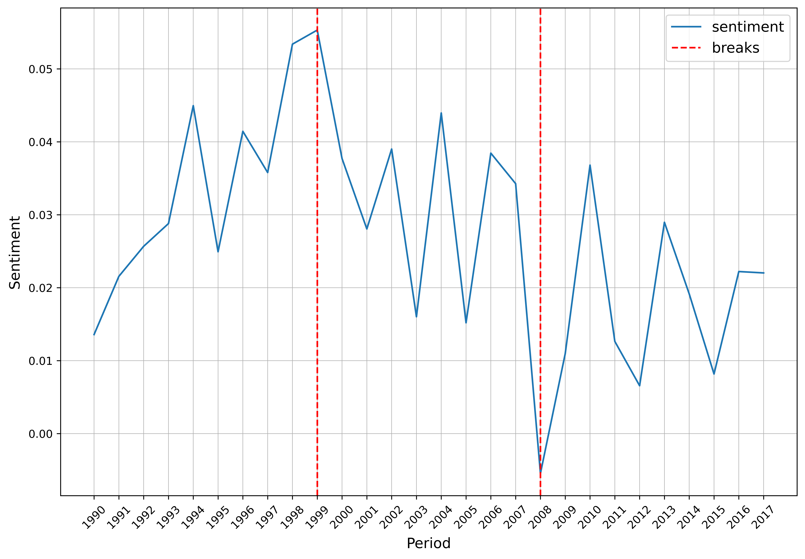

# Summary

Research meta-data is typically recorded as a time series with dimensions of cross-sections 
(e.g., article title, journal, volume, issue, author’s names, and affiliations) and time 
(e.g., publication date). Meta-datasets provide valuable insights into the research trends 
in a particular field of science. Meta-analysis (a group of methods to analyze research 
meta-data) currently does not implement text analytics in either programming language.
This package aims to fill that need. Arabica offers descriptive analytics, visualization, 
sentiment classification, and structural break analysis for exploratory analysis of 
research meta-datasets in easy-to-use Python implementation. 

The package operates on three main modules: (1) descriptive and time-series n-gram analysis 
provides a frequency summarization of the key topics in the meta-dataset, (2) visualization 
module displays key-term frequencies in a heatmap, line plot, and word cloud, (3) sentiment 
and structural breakpoint analysis evaluates sentiment from research article titles and 
identifies turning points in the sentiment of published research. It uses VADER [@Hutto 
:2014] and FinVADER (updated model with financial lexicons by @Koráb:2023) to classify 
sentiment. Clustering-based Fisher-Jenks algorithm [@Jenks:1977] finds break points in 
the data.

It provides standard cleaning operations for lower-casing, punctuation, numbers, and 
stopword removal. It is possible to remove more sets of stop words from ntlk.corpus at 
once to clean datasets from multilingual regions. 

As an example, the package helps analyze trends in economic research published in the 
leading economic journals (Econometrica, Journal of Political Economy, American Economic 
Review, Quarterly Journal of Economics, and Review of Economic Studies) from 1990 - 2017.
The meta-data is collected from Constellate.org.

A word cloud in Figure 1 displays the most frequent bigrams (two consecutive words) 
representing concepts, theories, and models that were central to researchers’ 
attention throughout the period. A heatmap in Figure 2 adds a time dimension and
plots the most frequent terms with yearly frequency. The line plot in Figure 3 
displays the most frequent concepts in an alternative form for a shorter period, 
and Figure 4 shows aggregated sentiment with two turning points (the 2007 - 2009 
financial crisis and the end of the Great Moderation period in economics in 1999). 

[Figure 1. Word cloud.](word_cloud.png)

[Figure 2. Heatmap.](heatmap.png)

[Figure 3. Line plot.](line_plot.png)

[Figure 4. Sentiment and breakpoint analysis.](sentiment_and_breakpoint_analysis.png)

The package has more general use for exploratory analysis of time-series text datasets, 
mainly in social sciences. In business economics, it improves customer satisfaction 
measurement through product reviews analysis. In politology and behavioral economics, 
it enables detailed text mining of social media interactions. Similarly, in finance, 
it simplifies financial sentiment analysis of news headlines.

Arabica is well-documented: its API reference and comprehensive tutorials can be found 
at https://arabica.readthedocs.io. For easy installation, the package is included in
the Python Package Index. Its code repository and issue tracker are hosted on 
GitHub at https://github.com/PetrKorab/Arabica.

# Statement of need

With Arabica, it is possible to visualize and analyze textual data in novel ways. 
These are some of the package’s distinguishing features: 

• Unlike the current packages to perform meta-analysis (e.g., @White:2017; @Mikolajewicz
:2019; @Balduzzi:2023), the package leverages text mining methods 
for in-depth analysis of research meta-data.

• Existing text analysis packages, such as texthero [@Besomi:2013], textdata 
[@Eunice:2019], and TextBlob [@Loria:2021], provide methods that explicitly focus 
on cross-sectional datasets and datasets without time variation. This perspective 
completely omits the time variability in text datasets. The time-series text approach 
provides additional insights into the qualitative changes in text data that are, 
as such, generated by human behavior. It involves the package's extension of the 
word cloud graph and financial sentiment classification for time-series text analysis.

# Dependencies

For most processing operations, Arabica uses data structures and methods from numpy, 
and pandas [@McKinney:2013]. It leverages nltk for natural language processing [@Loper 
:2002], and cleantext [@Gudiwada:2021] for data pre-processing. It uses Plotnine 
[@Wilkinson:2005] and Matplotlib [@Hunter:2007] for visualization. It also depends on 
vaderSentiment [@Hutto:2014], FinVADER [@Koráb, 2023], and jenkspy [@Viry:2023] 
to implement sentiment and breakpoint analysis.

# Acknowledgements